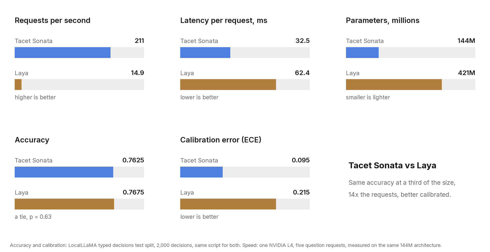

<p align="center">
  <picture>
    <source media="(prefers-color-scheme: dark)" srcset="assets/tacet-mark-light.png">
    
  </picture>
</p>

<h1 align="center">Tacet</h1>

<p align="center">
  <a href="https://huggingface.co/codepawl/tacet-sonata"></a>
  <a href="https://github.com/codepawl/tacet"></a>
  <a href="https://pypi.org/project/tacet/"></a>
  <a href="https://tacet.codepawl.com/docs"></a>
  <a href="https://codepawl.com/discord"></a>
  <a href="https://github.com/codepawl/tacet/blob/main/LICENSE"></a>
</p>

Tacet answers typed questions about a piece of state and gives a probability for every option.
It is an encoder, not a text generator: all questions and the state are packed into one sequence
and answered in one forward pass.

Three question types:

- **choice**: pick one of N named options. You get the pick, a probability per option and a confidence.
- **score**: place the state on an ordered rubric. You get a distribution over the levels and the expected score.
- **noul**: yes or no. You get the probability of yes.

The model is Tacet Sonata, [`codepawl/tacet-sonata`](https://huggingface.co/codepawl/tacet-sonata): 144M parameters,
fine tuned from [mmBERT-small](https://huggingface.co/jhu-clsp/mmBERT-small), trained on cases in 16
languages. It runs on a CPU; a GPU makes it faster.

## Install

```bash
pip install tacet
```

This pulls the default PyTorch build. For an NVIDIA GPU, install the CUDA build of PyTorch first
(see [pytorch.org](https://pytorch.org/get-started/locally/)), then `pip install tacet`. For Intel
graphics (Arc, Core Ultra), install the XPU build the same way
(`pip install torch --index-url https://download.pytorch.org/whl/xpu`); `device="auto"` finds it.

## Quickstart

```python
import tacet
from tacet import choice, score, noul

model = tacet.load("codepawl/tacet-sonata")  # or a local folder; device="cpu", "cuda" or "xpu"

result = model.decide(
    state={"ticket": "I was charged twice for my March invoice. Please refund the second charge."},
    questions={
        "route": choice("Which team should handle this?",
                        {"billing": "payments, invoices, refunds", "tech": "bugs and outages"}),
        "urgency": score("How urgent is this?", ["low", "medium", "high"]),
        "refund": noul("Is the customer asking for a refund?"),
    },
)
```

`result` has the shape the hosted Tacet API returned:

```json
{
  "model": "tacet-sonata",
  "answers": {
    "route": {"type": "choice", "choice": "billing",
              "probabilities": {"billing": 0.97, "tech": 0.03}, "confidence": 0.8},
    "urgency": {"type": "score", "score": 1.62,
                "probabilities": {"0": 0.05, "1": 0.28, "2": 0.67}, "confidence": 0.33,
                "legend": {"0": "low", "1": "medium", "2": "high"}},
    "refund": {"type": "noul", "noul": 0.91, "confidence": 0.91}
  },
  "usage": {"input_tokens": 71, "output_tokens": 0}
}
```

(The numbers above show the shape only.)

- `state` is a string, or any JSON object or array.
- `instructions` may be a string, or an object or array that is rendered to JSON text.
- `usage.state_truncated` or `usage.options_truncated` appears when the state was cut to fit
  the sequence, or an option was longer than the 48 tokens the model reads of it.
- An invalid request raises `tacet.RequestError`, which carries the same `status`, `code` and
  `param` the HTTP server returns.

Many requests at once:

```python
results = model.decide_batch(
    [{"state": text, "questions": questions} for text in tickets],
    batch_size=16,
)
```

### Options

```python
tacet.load(
    "codepawl/tacet-sonata",  # Hub repo id or local folder
    device="auto",           # "auto" picks CUDA, then an Intel XPU, then the CPU; bfloat16 on a GPU
    max_length=1536,         # packed sequence length in tokens, up to 4096
    revision=None,           # Hub branch, tag or commit
)
```

The questions go first in the sequence and the state fills the rest. Raise `max_length` for long
states; the cost of a pass grows with the length.

## Serve

`tacet serve` runs the hosted API's routes on your machine, so code written for the old Tacet API,
or for Jev's `/v1/systemone` format, can point its base URL at localhost.

```bash
tacet serve --model codepawl/tacet-sonata --port 8000
```

| route | what it does |
|---|---|
| `POST /v1/systemone` | the typed decision call |
| `POST /v1/chat/completions` | OpenAI style adapter: put `{"state": ..., "questions": ...}` as JSON in the last user message; the answers come back as JSON text in the assistant message. `stream: true` works. |
| `GET /v1/models` | the loaded model |
| `GET /v1/health` | `{"ok": true, "model": ...}` |

```bash
curl http://127.0.0.1:8000/v1/systemone \
  -H "Content-Type: application/json" \
  -d '{"state": "The export has been stuck for two days.",
       "questions": {"urgent": {"type": "noul", "instructions": "Is this urgent?"}}}'
```

- `model` in the body may be left out. It may also be the loaded model's name, `tacet`,
  `tacet-1` or `tacet-latest`, with or without a `codepawl/` prefix. Other names get a 404.
- Errors use the OpenAI style envelope `{"error": {"message", "type", "code", "param"}}` with the
  same codes as the hosted API (`invalid_request`, `model_not_found`, `state_too_large`,
  `questions_too_long`, `request_too_large`, `invalid_api_key`, `missing_api_key`).
- There is no authentication by default. `--api-key KEY` (or `TACET_SERVE_API_KEY`) makes the
  POST routes require `Authorization: Bearer KEY`. Set one before listening on anything other than
  localhost.
- Requests that arrive within a few milliseconds of each other share one forward pass.
- Request contents are never logged.

Other flags: `--host`, `--device`, `--max-length`, `--revision`. See `tacet serve --help`.

## Benchmark

<picture>
  <source media="(prefers-color-scheme: dark)" srcset="assets/benchmark-dark.png">
  
</picture>

`scripts/benchmark.py` scores a model on the test split of
[LocalLLaMA/typed-decisions](https://huggingface.co/datasets/LocalLLaMA/typed-decisions)
(400 cases, 2,000 decisions) with the metric definitions from Laya's evaluation.

From a clone of this repository:

```bash
uv sync --extra benchmark
uv run python scripts/benchmark.py --model codepawl/tacet-sonata
```

`--device cuda`, `--batch-size`, `--orderings N` (option order robustness) and `--out result.json`
are optional.

| model | parameters | accuracy | Brier | ECE |
|---|---|---|---|---|
| tacet-sonata | 144M | 0.7625 | 0.0678 | 0.095 |
| Laya | 421M | 0.7675 | 0.0615 | 0.215 |

Both rows were scored with this script on the same 2,000 decisions. The accuracy gap is not
significant (paired McNemar p = 0.63), so treat it as a tie. Tacet's probabilities are closer to
how often it is right (lower ECE), while Laya has the lower Brier score.

The train split of this benchmark is part of the training data for both models, so these are in
distribution numbers for its four workflows.

We also check free text on our own suite of 386 hand written cases in 8 languages (not public, to
keep it out of training data). There Tacet Sonata answers 53.9% of 1,192 questions the way the case
author did, where our first release candidate, trained on the benchmark alone, got 37.9%. Chance is
about 35%.

## Limits

- Tacet is strong on the benchmark's four workflows (customer service, invoice processing,
  security incidents, agent trace observability) and on routing and triage questions like them.
- Yes or no answers depend a lot on wording. They are more reliable when the question uses the
  same words as the text ("refund" in both) than when it paraphrases ("money back").
- It is weaker on long free text, on questions that need date arithmetic, and on counting
  (for example, how many log rows meet two conditions). If a decision depends on a number, compute
  the number in code and put it in the state.
- The probabilities are calibrated on the training distribution. On inputs far from it, check
  them against your own labelled examples before you gate anything on a confidence threshold.
- It reads at most `max_length` tokens (1536 by default, 4096 at most). A longer state is cut, and
  `usage.state_truncated` tells you.
- It does not generate text or explain its answers.

## License

Apache 2.0, see [LICENSE](LICENSE). Third party attributions, including the mmBERT backbone
(MIT) and the training datasets, are in [NOTICE](NOTICE).

Questions: hello@codepawl.com
